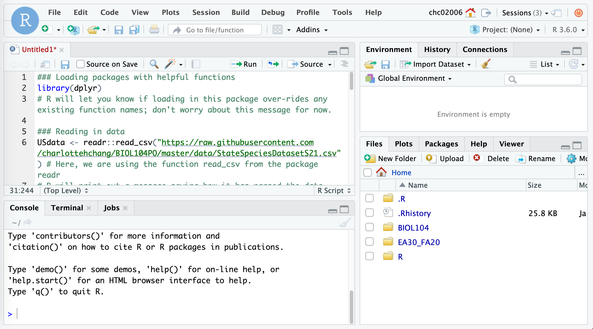
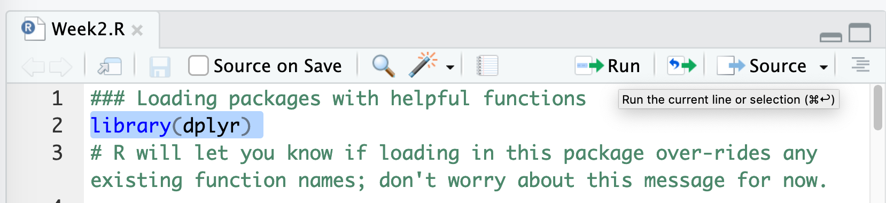

Data is an essential part of understanding climate patterns and changes over time. In this tutorial, you will learn how to load, manipulate, and visualize data to draw meaningful insights about climate change.

For this climate change activity, we will work with datasets that provide evidence for global climate change. This tutorial will guide you through using `R`, specifically the Tidyverse, to interact with and analyze climate data. 

We will focus on basic data manipulation and visualization techniques using the `dplyr` and `ggplot2` packages.

# Interacting with Climate Data using the `dplyr` package

We are going to encounter some methods for interacting with, visualizing, and analyzing earth sciences data in this activity.

Please start by logging into [rstudio.pomona.edu](https://rstudio.pomona.edu). 

**Note**! If you run the command `library(package)` and see an error in red text stating `Error in library(package) : there is no package called ‘package’`, don't worry! That simply means that the package is not installed in your `R` environment. All you need to do is just run `install.packages(package)` **once**. (Of course, replace `package` with the name of the package in question, such as `swirl`).

First, we will all load these packages.

```{r setup, include=FALSE, message=FALSE, warning=FALSE}
knitr::opts_chunk$set(echo = TRUE)
```

```{r data, message=FALSE}
library(dplyr)
library(openxlsx)
library(ggplot2)

# Load the dataset from the web
sheet_url <- "https://github.com/EA30POM/Fall2021/blob/main/data/ClimateChangeSigns.xlsx?raw=true"
keelingCO2 <- openxlsx::read.xlsx(sheet_url, sheet="Keeling")
```

# Data operations

In this module, we will focus on the following types of queries for data tables:

* `View()`: open up a spreadsheet viewer to display the data
* `filter()`: subsetting a data table based on values in **rows**
* `select()`: subsetting a data table based on specific **columns** given by their names
* `arrange()`: sorting rows based on the values of specified columns

We will use these operations to explore the climate dataset, such as filtering for specific years or selecting particular variables of interest.

# Scripting

Today, we will also embark on writing `R` scripts to store our commands. We will even be able to execute the code interactively from the script editor (much like a text editor or some other type of notepad). 

NB: If you have used `.Rmd` (R Markdown) files before, you are more than welcome to use an R Markdown file. But for purposes of the general teaching in this class, I will introduce `R` scripts.

# Steps

1. Open up RStudio.
2. Open an `.R` script
    + Note that you can navigate to the bars in between each pane until you see a `r fontawesome::fa("arrows-alt", fill="black")` icon, which you can use to drag the panes to be larger or smaller 
3. Subsequently, as you read through this tutorial, please copy the code into the `R` script and use the file as a way to track your commands:
    + Note that below, any line starting with the pound sign `#` is a *comment*.
    + Comments are text that are not executed by `R`.
    + In general, it is good practice to "comment your code" -- that is, use comments to annotate your code for future reference.
When you've copied in the code into the `R` script, it will look something like this:



4. Next, save the file when you make changes using the `r fontawesome::fa("save")` icon and give it an informative name.
5. Now you can run the code **from the script editor directly**! 
6. The easiest way to run the code is to highlight each line of code and either type `⌘ + Enter` (people who have Mac OS) or `CTRL + Enter` (Windows and Linux).
You can also highlight each line of code with your mouse and use the "run code" button at the top right-hand side of the text editor pane:

7. Note that running each line of code from the text editor (from the `R` script in this case) is the same as typing the commands into the console. You typed commands directly into the console last week in your initial interactions with `R`.
8. Writing scripts is advantageous because you can store your commands somewhere convenient and revisit or edit the file anytime.

# Interacting with climate data

## Opening up a spreadsheet viewer

Oftentimes, we may want a more intuitive way to see our data tables. It can be really annoying when `R` is too clever and only displays a subset of the columns of your spreadsheet. The `View()` function pulls up an Excel-style data viewer. Let's try it below:

```
View(keelingCO2)
```

## Filtering Rows

The `filter()` function allows you to subset a data table based on the values in the rows. For instance, to filter the Keeling CO2 data to include only the records from the year 2000 and later, you can use:

```{r, eval=F}
filtered_data <- dplyr::filter(keelingCO2, Year >= 2000)
head(filtered_data)
```

## Selecting Columns

The `select()` function allows you to subset the data table to include only specific columns by their names. For example, if we only want to keep the CO2 column:

```{r, eval=F}
selected_data <- dplyr::select(keelingCO2, meanCO2ppm)
head(selected_data)
```

## Arranging Rows

The `arrange()` function allows you to sort the rows of your data table based on the values of specific columns. For example, if you want to arrange the data by the CO2 concentration in descending order:

```{r, eval=F}
arranged_data <- dplyr::arrange(keelingCO2, desc(meanCO2ppm))
head(arranged_data)
```

# Merging datasets

Sometimes, data that we want to combine for analyses are separated across different spreadsheets or data tables. How can we combine these different data tables? `Join` operations ([FMI on `join`ing two data tables](https://statisticsglobe.com/r-dplyr-join-inner-left-right-full-semi-anti)) offer a way to merge data across multiple data tables (also called data frames in `R` parlance).

Below, I will first create two data tables that store different characteristics about fruit.

```{r join_dfs, warning=FALSE,message=FALSE}
### Load dplyr and stringr packages into R workspace
library(dplyr)
library(stringr)

### Table storing colors of 5 fruits
dt1 <- tibble::tibble(fruit=c("apple","pear","orange","kiwi","mangosteen"),
                      color=c("red","green","orange","brown","purple"))
dt1 # display table
### Table storing prices of 3 fruits
dt2 <- tibble::tibble(fruit=c("pear","orange","mangosteen","cherimoya"),
                      price=c(1.25,1,5,4.7)) # price per pound
dt2 # display table
```

All join operations assume there is some column between your data tables that has consistent values that you can use to merge the records in the data tables together. In the case of this simple example, the shared column is `fruit`.

## Left join

The first join that we will look at is the `left_join` function from the `dplyr` package. The `left_join` will keep all of the rows in the left-hand side table and attempt to match entries from the second (right-hand side) table. If there is no match, `R` will populate `NA` (missing value) at that missing join location.

```{r lft_join}
left_join(dt1, dt2)
# Note that the left_join function detects that both data tables both have a column named "fruit". What would happen if they didn't have a column with the same name?
```

We see that `R` has merged the two data tables, `dt1` and `dt2` together; the resulting data table above has all of the unique columns across these two data tables (`fruit` - the column we used to merge the two data tables together, `color` from `dt1`, and `price` from `dt2`). We also see that `R` has matched the records across the two data tables--see for yourself for example that the row for `pear` has the correct values from `dt1` (`color=green`) and `dt2` (`price=1.25`).

### What is going on with those weird `NA` values?

What we see above is that because `dt2` didn't have any data for `apple` and `kiwi`, `R` has attempted to match all 5 fruits from `dt1` (left-hand side data table) with the fruits in `dt2`, and the fruits that were in `dt1` but not `dt2` get an `NA` value in the `price` column, which is merged from `dt2` to `dt1`. Note also that the fruit that is **only** in `dt2` but not `dt1` doesn't show up in the merged data table (no `cherimoya` row).

## Right join

In this case, `R` retains all of the records from `dt2`. Because `dt1` has some fruits that `dt2` does not, that means that the fruits that are **unique** to `dt1` *will not* show up in the merged data table.

```{r right_join}
right_join(dt1, dt2)
```
As before, because `cherimoya` is only defined in `dt2`, but not `dt1`, `R` populates an `NA` value for all of the columns that are coming from `dt1` (in this case, the column `color`) to the final merged data table.

## Inner join

In the `inner_join` function, only those rows that have exact matches across the two data tables are preserved in the final merged data table.


```{r inr_join}
inner_join(dt1, dt2)
```

We see that this resulting data table presents only the three fruits that are included in both `dt1` and `dt2`.

## Full join

In a full join operation, all unique elements across `dt1` and `dt2` are preserved in the final merged data table. For non-matching pairs, `R` will fill in an `NA` value.

```{r fl_join}
full_join(dt1, dt2)
```

We see that this merged table has all 6 unique fruits across the two data tables. We see that `R` has assigned `NA` in `price` (the column from `dt2`) for the two fruits that are in `dt1` but **not** `dt2` (`apple` and `kiwi`). We also see that there is an `NA` value in `color` (the column from `dt1`) for `cherimoya`, which is a fruit that was only listed in `dt2`.

## The need for consistency to ensure successful joins

`R` can't read our minds, for better or for worse. So if we notice that our data tables are not consistent in how they present the fruits, then we'll see different join behavior. `R` is looking for an exact match of the words in the joining column (`fruit`).

```{r misspelling_fruits}
### Modifying dt2
dt2 <- tibble::tibble(fruit=c("Pear","Orange","Mangosteen","Cherimoya"),
                      price=c(1.25,1,5,4.7)) # price per pound
dt2 # display table
# dt1 # display dt1 to compare the fruit column visually
### See what happens - R can't join the fruits up - the words are not identical because R is case sensitive
full_join(dt1,dt2) 
```

Dang! `R` has treated `pear` as a different value than `Pear`. That's really silly and unfortunate. It's not "automagically" joining up the data across the two tables because `R` is case sensitive (that is, `pear` is different from `Pear` to `R`).

We can fix this example here by taking `dt2` and making the `fruit` column all lower-case then re-running the join operation.

```{r new_dt2}
### Let's fix this problem and make the fruit names consistent
dt2new <- dt2 %>% 
  mutate(fruit=tolower(fruit)) # a function that takes character/strings (words) and converts them to lower case
dt2new # confirm that now the fruit names are lower case
### Re-run full_join
full_join(dt1,dt2new)
```

### Additional exercises to build understanding

Given `dt1`, `dt2`, and `dt2new` that have just been defined above, run and contrast the outputs of the following:

* `left_join(dt1, dt2)`
  + versus: `left_join(dt1, dt2new)`
* `right_join(dt1, dt2)`
  + versus: `right_join(dt1, dt2new)`
* `inner_join(dt1, dt2)`
  + versus: `inner_join(dt1, dt2new)`
  + notice that `inner_join(dt1, dt2)` tells you that it didn't find any matches! It produces a table that has `0 x 3` dimensions, or `0` rows because it didn't find any matching records across `dt1` and `dt2`.
  
## An example with climate data

Below, we are going to join the CO2 observation data with data on sea ice extent. We are going to combine these data by matching them based on the year of each observation. Something to think about: if we are using `year` to match these data, what are we assuming about the data in order to justify this match?

```{r, eval=F}
seaIce <- openxlsx::read.xlsx(sheet_url,"SeaIce")
seaIceCO2 <- left_join(seaIce, keelingCO2, by=c("year"="year")) # we are joining up the sea ice extent data with global CO2 level data, matching on each year
```